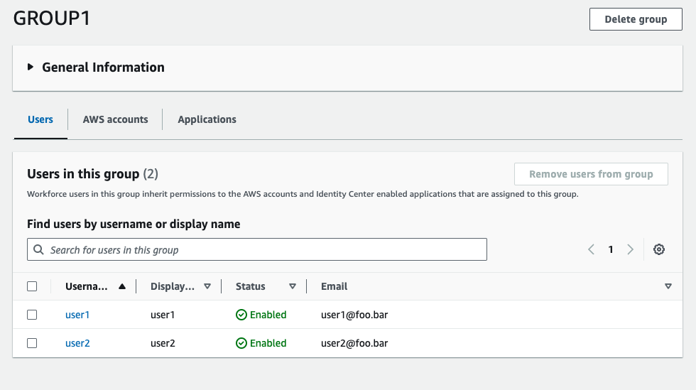
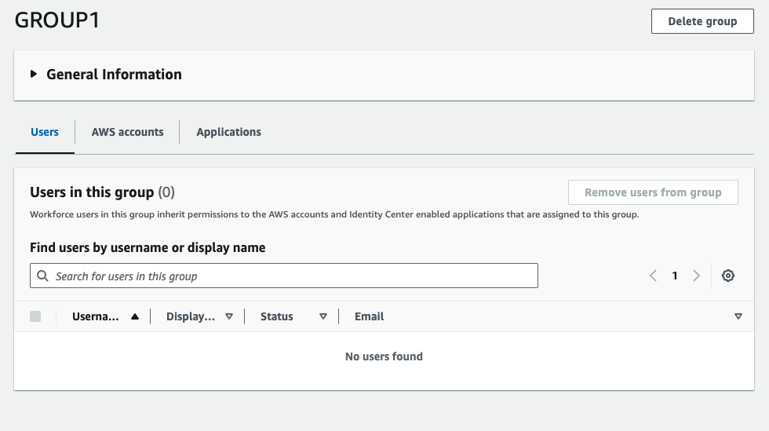

# AWS Wrong implementation of the SCIM protocol

* Author: Gustavo Lichti Mendonça
* Mail: gustavo.lichti@gmail.com
* This Code: https://github.com/lichti/aws-iam-scim-problem

## Apology for cyberarch

On November 6, 2021, I published a repository called [AWS-SSO-PROVISIONING](https://github.com/lichti/aws-sso-provisioning) criticizing CyberArk. However, on March 4, 2023, I forked it and created another repository called [aws-sso-google-sync](https://github.com/lichti/aws-sso-google-sync). While implementing the routine to [Remove or Empty deleted groups from Google Directory](https://github.com/lichti/aws-sso-google-sync?tab=readme-ov-file#remove-or-empty-deleted-groups-from-google-directory), I discovered a logic error in the [UpdateGroup](https://github.com/lichti/aws-sso-provisioning?tab=readme-ov-file#updategroup) method that prevented the routine from executing when `members` was an empty list. That day, after much head-scratching, I identified the mistake that I am now disclosing.

This disclosure comes in the form of an apology to CyberArk because one of the issues was precisely this, and had it not been for a logic error, I would have understood it, and the public criticism would not have existed.

## Show me the ~~code~~ problem!

Learning more abut SCIM:
* https://datatracker.ietf.org/doc/html/rfc7642
* https://datatracker.ietf.org/doc/html/rfc7643
* https://datatracker.ietf.org/doc/html/rfc7644
* https://openid.net/specs/fastfed-scim-1_0-02.html#rfc.section.4

### 1. Correct, but doesn't work

When we need to update a group with an empty list using SCIM, the correct payload is:

```json
{
    "schemas":["urn:ietf:params:scim:api:messages:2.0:PatchOp"],
    "Operations":[
        {
            "op": "replace",
            "path": "members",
            "value":[]
        }
    ]
}
```

The `value` must be an empty list. When we perform this action on the AWS IAM Identity Center SCIM Endpoint with the correct payload, it returns an HTTP status code of 200 but does not remove users from the group. See below:


```python
def updateGroup1(group_id=None, operation=None, members=None):
    if group_id and operation:
        print(f"Updating {group_id}")
        data = {
            "schemas":["urn:ietf:params:scim:api:messages:2.0:PatchOp"],
            "Operations":[
                {
                    "op": f"{operation}",
                    "path": "members",
                    "value":[{"value": f"{member}"} for member in members]
                }
            ]
        }
        print(json.dumps(data))
        res = patch(path=f"Groups/{group_id}", data=json.dumps(data))
        if res.status_code == 204:
            print(res)
            print(res.content)
            return True
        else:
            print(res)
            print(res.content)
            return False

updateGroup1(getGroupIBByName('GROUP1'),"replace",[])

```
**Response**

```json
Updating 2408a4d8-b041-7060-a8c0-837ef3bb0c21
{"schemas": ["urn:ietf:params:scim:api:messages:2.0:PatchOp"], "Operations": [{"op": "replace", "path": "members"}]}
<Response [204]>
b''
```

**See, the group still contains the users.**



### 2. Correct, but doesn't work (Other case)

From [AWS IAM Identity Center Documentation](https://docs.aws.amazon.com/singlesignon/latest/developerguide/patchgroup.html):

> In the value field, provide a list of objects containing the value of the user id. Multiple members can be removed at a time. If the value field contains an empty list or is not provided, all of the path’s members will be removed.

Then, let's test a new payload without `value`:

```json
{
    "schemas":["urn:ietf:params:scim:api:messages:2.0:PatchOp"],
    "Operations":[
        {
            "op": "replace",
            "path": "members",
        }
    ]
}
```

Again, when we execute this action on the AWS IAM Identity Center SCIM Endpoint with another correct payload, it returns an HTTP status code of 204 but does not remove users from the group. See below:

```python
def updateGroup2(group_id=None, operation=None, members=[]):
    if len(members) > 0:
        data_values = [{"value": f"{member}"} for member in members]
        data = {
            "schemas":["urn:ietf:params:scim:api:messages:2.0:PatchOp"],
            "Operations":[
                {
                    "op": f"{operation}",
                    "path": "members",
                    "value": data_values
                }
            ]
        }
    else:
        data = {
            "schemas":["urn:ietf:params:scim:api:messages:2.0:PatchOp"],
            "Operations":[
                {
                    "op": f"{operation}",
                    "path": "members",
                }
            ]
        }
        
    if group_id and operation:
        print(f"Updating {group_id}")
        print(json.dumps(data))
        res = patch(path=f"Groups/{group_id}", data=json.dumps(data))
        if res.status_code == 204:
            print(res)
            print(res.content)
            return True
        else:
            print(res)
            print(res.content)
            return False

updateGroup2(getGroupIBByName('GROUP1'),"replace",[])
```

```json
Updating 2408a4d8-b041-7060-a8c0-837ef3bb0c21
{"schemas": ["urn:ietf:params:scim:api:messages:2.0:PatchOp"], "Operations": [{"op": "replace", "path": "members"}]}
<Response [204]>
b''
```

**See, the same result, group still contains the users.**


### 3. Wrong, but work

Now we will proceed with the incorrect payload:

```json
{
    "schemas":["urn:ietf:params:scim:api:messages:2.0:PatchOp"],
    "Operations":[
        {
            "op": "replace",
            "path": "members",
            "value":[{"value": ""}]
        }
    ]
}
```

Now, the AWS IAM Identity Center SCIM Endpoint will return an HTTP status code of 400 along with an error message, but it removes users from the group. See below:


```python
def updateGroup3(group_id=None, operation=None, members=[]):
    if len(members) > 0:
        data_values = [{"value": f"{member}"} for member in members]
    else:
        data_values = [{"value": ""}]
        
    if group_id and operation:
        print(f"Updating {group_id}")
        data = {
            "schemas":["urn:ietf:params:scim:api:messages:2.0:PatchOp"],
            "Operations":[
                {
                    "op": f"{operation}",
                    "path": "members",
                    "value": data_values
                }
            ]
        }
        print(json.dumps(data))
        res = patch(path=f"Groups/{group_id}", data=json.dumps(data))
        if res.status_code == 204:
            print(res)
            print(res.content)
            return True
        else:
            print(res)
            print(res.content)
            return False

updateGroup3(getGroupIBByName('GROUP1'),"replace",[])

```

**Response**

```json
Updating 2408a4d8-b041-7060-a8c0-837ef3bb0c21
{"schemas": ["urn:ietf:params:scim:api:messages:2.0:PatchOp"], "Operations": [{"op": "replace", "path": "members", "value": [{"value": ""}]}]}
<Response [400]>
b'{"schema":["urn:ietf:params:scim:api:messages:2.0:Error"],"schemas":["urn:ietf:params:scim:api:messages:2.0:Error"],"detail":"Request is unparsable, syntactically incorrect, or violates schema.","status":"400","exceptionRequestId":"59370c32-f096-4892-8e37-94b4581f1f03","timeStamp":"2024-04-05 06:32:12.227"}'
```

**See now, although an error was returned, the group is empty.**



### Just one more complaint, if I may

The `GET /Groups/<ID>` method returns the `members` attribute as empty. According to [RFC7643](https://datatracker.ietf.org/doc/html/rfc7643#section-8.4), it should return this JSON:

```json
 {
     "schemas": ["urn:ietf:params:scim:schemas:core:2.0:Group"],
     "id": "e9e30dba-f08f-4109-8486-d5c6a331660a",
     "displayName": "Tour Guides",
     "members": [
       {
         "value": "2819c223-7f76-453a-919d-413861904646",
         "$ref":
   "https://example.com/v2/Users/2819c223-7f76-453a-919d-413861904646",
         "display": "Babs Jensen"
       },
       {
         "value": "902c246b-6245-4190-8e05-00816be7344a",
         "$ref":
   "https://example.com/v2/Users/902c246b-6245-4190-8e05-00816be7344a",
         "display": "Mandy Pepperidge"
       }
     ],
     "meta": {
       "resourceType": "Group",
       "created": "2010-01-23T04:56:22Z",
       "lastModified": "2011-05-13T04:42:34Z",
       "version": "W\/\"3694e05e9dff592\"",
       "location":
   "https://example.com/v2/Groups/e9e30dba-f08f-4109-8486-d5c6a331660a"
     }
   }
```